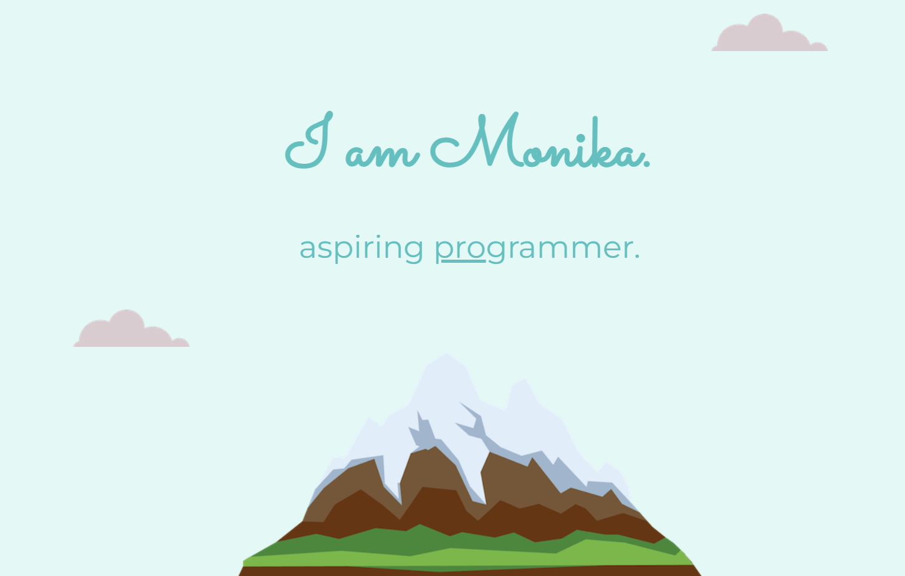

<h1 align="center">Personal site</h1>
  
Project for learning CSS and HTML.

 
 

## What is this project about?
This is a personal site with few brief notes about me and how people can contact me.
 
 

## Technologies used
- HTML
- CSS
- GIT
 

## What have I learned?
- what are favicons,
- HTML divs,
- the box model of website styling,
- CSS display property,
- CSS static, relative and absolute positioning,
- centering elements with CSS,
- font styling,
- CSS sizing,
- CSS float and clear.
 
 

*project was based on [Web Development Course](https://www.udemy.com/course/the-complete-web-development-bootcamp/)
